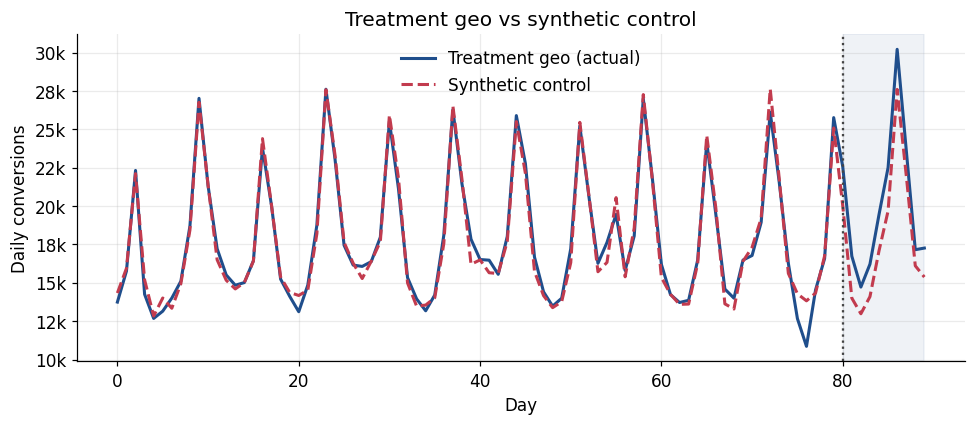
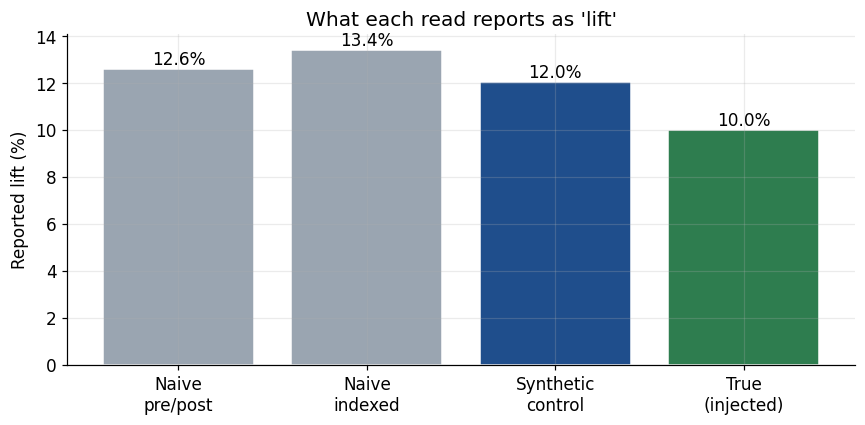

# Geo-Lift Incrementality Test

When a brand spends on ads, did the ads cause the extra sales, or would those customers
have bought anyway? Platform dashboards and last-click can't separate the two. A geo-lift
can: change spend in some regions, leave others alone, and compare the treated regions
against a **synthetic control** built from the untreated ones.

I ran the full method on Meta's open [GeoLift](https://github.com/facebookincubator/GeoLift)
example data. To check that it actually works, I injected a known **+10%** lift into a
treatment group and tried to recover it.

The full walkthrough, with the reasoning behind each step, is in
**[`geolift_walkthrough.ipynb`](geolift_walkthrough.ipynb)**.

## Result

| | |
|---|---|
| Recovered lift | +12.0% (95% CI 6.1 to 18.0%) |
| True injected lift | +10% |
| Significance | permutation p < 0.005 (beat all 200 placebo groups) |
| Pre-period fit | 2.9% MAPE |
| Backtest (in-sample vs out-of-sample) | 2.9% vs 2.9% MAPE |
| Placebo in time | -4.4%, inside the noise band (no false effect) |
| Robustness | survives a sustained counterfactual bias up to ~6% of baseline; the pre-period gap was ~4% with no trend |
| Min. detectable effect (10-day window) | ~8.5% at 80% power |



The synthetic control tracks the treatment regions to within 2.9% through the 80-day
pre-period, then the actual series pulls above it during the test window. This tight
match enables the post-period gap to be believable.

### The naive read overstates it

A simple pre/post read reports +12.6%, and an indexed comparison against raw controls
reports +13.4%. Both credit the campaign with movement the control markets also show,
and neither comes with a confidence interval. The synthetic control nets that out and
lands at +12.0%, closest to the true +10%.



## How it works

1. Split into a pre-period (fit) and a test window (measure).
2. Pick a treatment group and match control markets by pre-period fit.
3. Build the synthetic control with non-negative least squares on the pre-period.
4. Check pre-period parity before trusting anything.
5. Estimate the lift, then test it against a null of random untreated groups.
6. Stress-test the counterfactual: expanding-window backtest + a placebo-in-time check.
7. Size the test with a power/MDE curve, and cross-check with a Bayesian counterfactual.
8. Sensitivity: find how large a trend violation would have to be to change the answer, and compare it to the divergence the pre-period actually showed.

## Why the validation matters

The lift is one subtraction, whereas the work really lies in earning the right to trust the counterfactual
behind it. Three checks do that from different angles: pre-period parity (does the
control match before the test), a backtest (do the weights generalize out of sample),
and a placebo in time (does the method stay quiet when nothing happened). The identifying
assumption is that the control blend which matched before the campaign would have kept
matching without it. Although these checks support that and serve as evidence for the strength
of the counterfactual, its important to keep in mind they don't necessarily prove it.

## Run it

```bash
pip install -r requirements.txt
jupyter notebook geolift_walkthrough.ipynb   # run top to bottom
```

The notebook writes the figures and `results.json` as it runs. It's reproducible
(seed 42).

## Experimental limitations

- The +10% lift is injected to validate the method, not a live campaign result.
- A 10-day window underpowers small effects and a real ~5% test definitely would need a longer window or more markets.
- Inference assumes the donor pool represents the treatment group's counterfactual, and our alidation checks support that but don't prove it.

## Data

Meta's open-source GeoLift example set: 40 geographies, daily conversions, 90 days.
The `.rda` files are in `data/`.

Built by Bilal Zafar — [linkedin.com/in/bilal-zafar1](https://linkedin.com/in/bilal-zafar1)
